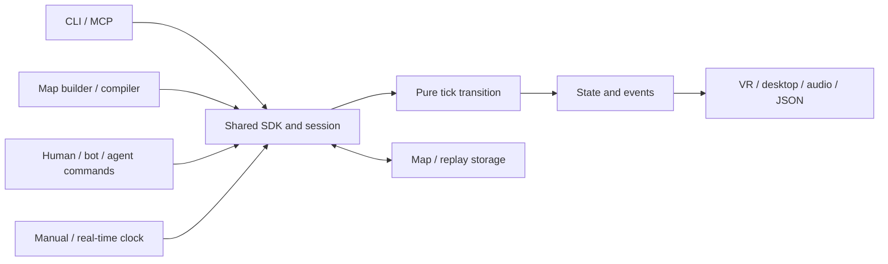

# StateBeats

A spatial rhythm engine that plays the same way in a headset, a terminal, or an agent's tool loop.

The backend is the product: a dependency-free mathematical kernel with explicit integer time,
shared TypeScript SDK, versioned maps and compiled sequences, deterministic replay, a native
programmatic builder, CLI and MCP. The reference player adds standalone WebXR, desktop controls,
spatial sound, local music import and original music through adapters. Moving emitters,
scene paths and shared music signals let communities build different worlds on the same rules.
No commercial or full game engine is used.

**0.3.0 development release candidate.** Headless and desktop checks are recorded in
[acceptance evidence](docs/ACCEPTANCE.md). Standalone Quest 3 support is implemented;
real-headset controls, comfort, audio usability and performance remain to be tested.

## Play locally

Use Node **24 LTS** and npm. From the repository directory:

```sh
npm ci
npm run build
npm run play
```

Open **http://127.0.0.1:4173**. Choose **First orbit** to learn the controls, **Chasing the sun**
for a moving-sun landscape, or **A sky full of stars** for its space variation. Select
**Play on desktop** or **Watch a bot**. The original sun journey contains 66 star/hold
interactions and five passing bird hazards across a full turn.

**Featured: [Event Horizon — Master](docs/EVENT_HORIZON.md).** A complete original 2:40,
150 BPM electronic track ships with the game and loads automatically. Its 620 scoring
targets include wide linked chords, 52 moving holds, musical sweeps and answering turns,
stationary constellations, and seven duck/lean passages. No files need importing.
Use `?map=event-horizon-master` to link to this selection. First orbit remains the default.

**Collaboration: [Ink-Battle — Between the Lines](docs/INK_BATTLE.md).** Stand between
two armies inside Ink-Battle's original painted book. Six age chapters, a bundled
3:20 score and 358 marked head strikes, crossfire parries, falling specials and
two-hand heavy blocks. The surrounding war uses verified recordings of the actual
Ink-Battle engine; the neutral-player rhythm encounters are an adaptation and do
not change the recorded battle outcome. Select `?map=ink-battle-between-the-lines`.

Mouse left/right control independent stored hand aims; hold to sustain contact. Space places both
hands at the reticle. Q/E turn, Up/Down look vertically, C ducks beneath birds, Escape pauses. Mouse bindings, speed and
audio offset are in Settings, along with music/cue channels, text captions, contrast and reduced motion.
Dragging moves the most recently pressed hand, while the other retains its aim. Desktop input
assists target depth under the pointer; Quest controllers use their actual tracked positions.
The reference controls deliberately use reach/contact mechanics; optional directional maps require
actual hand movement in the requested direction.

**Text play:** open **http://127.0.0.1:4173/text.html**. This separate player requires no WebGL,
audio or real-time input. Read the scene, choose a hand and target, advance explicit ticks, and
save the same deterministic replay. It supports keyboard and screen-reader navigation and
clearly identifies its assisted manual timing mode.

**Audio-led play:** open **Audio-led setup** and select **Finding the pulse** for audible hands,
alignment tones, hand-specific hold vibrations and spoken controller menus. Its one-minute
tutorial uses the same map and hit rules as visual/text play. See the
[nonvisual play contract and controls](docs/NONVISUAL_PLAY.md). Physical Quest listening and
blind-player usability validation are still pending.

Under **Your music & community maps**, select local audio, enter its BPM, and generate a
map of musical movement phrases. **Shape your movement** controls beat offset, reach, arrival
style, facing range, rails, paired notes, crossovers and optional ducking. Rebuild from the stored
analysis, inspect the summary, and save the generation report. Try **Phrases in orbit** for an
original demonstration of rail counterpoint and phrase-based turns.
Quick setups run from **Beginner** to **Master**. Master enables wide movement and musical
360° turns with notes arriving throughout. Turn size, speed, acceleration and directional
travel remain independently adjustable. See [musical turn planning](docs/TURNS.md).

Held paths reveal a short moving arc ahead of the note and fade behind it. Shared
presentation cues work with manual ticks, replay and every perception adapter; creators
control appearance, emergence and release effects independently of scoring. See
[note presentation and adapter contracts](docs/NOTE_PRESENTATION.md).
Settings also has manual **height** and **room scale** for every map, applied on the next start.
For wider play at 1.65 m, set height **1.65** and room scale **1.20**. Our room scale spreads X/Z
positions; height controls vertical layout. Collision sizes stay authored and recordings retain
the profile used.
Music features, generation settings and note paths are saved in exported
JSON; audio stays local. Load a community map and its matching soundtrack through the same
controls. Browser decoding supports the formats available on the current device.

The generator separates musical selection, phrase composition and facing planning through
typed, replaceable adapters. Reach, hand reservation and speed checks produce explicit reasons
for omitted candidates. These checks support authoring; physical comfort and room clearance need
headset validation. See [choreography APIs and controls](docs/CHOREOGRAPHY.md) and
[the long-term direction and quality gates](docs/DIRECTION.md).

For Quest Browser, see [the short standalone guide](docs/QUEST_PLAYTEST.md). A static HTTPS host
is enough; simulation runs locally on the headset. No PC simulation, Link, accounts, keys or API
subscription is required. Local USB forwarding is an optional development setup.

**Public hosting:** [GitHub Pages deployment](docs/HOSTING.md) is configured for
`https://ronitervo.github.io/StateBeats/`. Reviewed maps/adapters registered in the project become
available after merge and verification. Local imports are private; they are not public uploads.

## Use the engine

```sh
npm run demo
node examples/headless.mjs
node examples/scenes.mjs
node examples/choreography.mjs
node packages/cli/dist/index.js maps
node packages/cli/dist/index.js generate 42 generated.json
node packages/cli/dist/index.js validate generated.json
```

The demo should report **8 hits, 800 points and a verified replay**. The full headless example builds
a map, binds an actor, submits poses, advances time, restores a checkpoint and proves both a correct
hit and a wrong-hand miss. It writes its replay under `artifacts/`.

```js
import { Session, standardActor } from '@statebeats/sdk';
import { sampleMap } from '@statebeats/content';

const session = await Session.create(sampleMap('agent-arena'), [standardActor()]);
const player = session.client({ role: 'player', actorId: 'player', controlTime: true });
player.submit('pose-request', [{
  id: 'pose-1', tick: 1, type: 'pose', actorId: 'player', effectorId: 'left',
  position: [0, 1.4, -0.8],
}]);
player.advanceOnce('step-1', 240);
console.log(player.observe());
session.close();
```

Observing never advances time. Retrying `step-1` with the same count returns its original result.
Only the host can give a caller a role or time-control capability. Registering a policy is a trusted
host operation; JSON maps cannot load or execute code.

## Packages and contracts

| Package | Responsibility |
|---|---|
| `@statebeats/core` | Pure next-tick transition, relative swept contact, requirements and policy contracts |
| `@statebeats/sdk` | Validation, compiler/builder, sessions, capabilities, clocks, replay and service operations |
| `@statebeats/content` | Ten catalog sequences, including Event Horizon, Ink-Battle and the audio-led tutorial |
| `@statebeats/ink-battle` | Apache-2.0 battle recordings, original sketchbook art and rhythm adaptation |
| `@statebeats/adapters-node` | Atomic filesystem map/replay stores with opaque filenames |
| `@statebeats/cli` | SDK service over commands or persistent JSON lines |
| `@statebeats/mcp` | Real stdio MCP server for agents |
| `@statebeats/player` | Reference Three.js/Web Audio/WebXR client, simulation worker |

Community extensions can replace actors, perception, clock, storage, compilation, interaction
eligibility/state, scoring and arbitration. [Runnable extension examples](examples/extensions.mjs)
show an observation-only bot, JSON sense, double-entry requirement, flat score and reversed priority.
The core's supported geometry and tick/lifecycle invariants remain the common contract.
Scene objects, motion/emitter tracks, appearance identifiers and music features are data-only
SDK contracts. A [community mole appearance](examples/community-appearance.ts) demonstrates
adding a ground-level creature without changing gameplay code. See the
[scene, music and access guide](docs/SCENES_MUSIC_ACCESS.md) for limits and interfaces.
Reusable [spatial sound themes](docs/SPATIAL_AUDIO.md) add moving effects independently of
visual art, with saved music, guidance and world-effect mix controls.



- [Architecture and deterministic behavior](docs/ARCHITECTURE.md)
- [SDK, map format, adapters and compatibility](docs/SDK.md)
- [CLI/MCP operations and complete agent loop](docs/TOOLS.md)
- [Quest setup and playtest](docs/QUEST_PLAYTEST.md)
- [Evidence, limitations and release checklist](docs/ACCEPTANCE.md)
- [Contributing](CONTRIBUTING.md), [security model](SECURITY.md), [changes](CHANGELOG.md)

## Verify and package

```sh
npm run check
npx playwright install chromium firefox webkit
npm run test:e2e
npm run benchmark
npm run release:local
```

`check` includes strict types, tests, import/host boundaries, formatting and production build.
Browser conformance compares Node with Chromium, Firefox and WebKit; the reference graphical
player baseline is Chromium. Benchmarks report the actual machine and do not represent Quest.
The CI workflow is prepared for Windows, Linux and macOS; local evidence does not imply CI has run.

`release:local` creates source/player archives, seven npm tarballs and SHA-256 checksums in
`artifacts/release/0.3.0/`, then installs all public tarballs together in a fresh directory and runs the CLI
and packaged scene/music SDK checks.
The source archive includes the lockfile. Source is maintained at
[RONITERVO/StateBeats](https://github.com/RONITERVO/StateBeats). The npm packages are **not published**;
use the local tarballs until a maintainer publishes under an available namespace.

StateBeats code is [MIT](LICENSE). Original maps and procedural audio output are
[CC0](CONTENT_LICENSE.md), except the [Apache-2.0 Ink-Battle collaboration](packages/ink-battle/NOTICE).
Dependency notices are included in [THIRD_PARTY_NOTICES.md](THIRD_PARTY_NOTICES.md).
