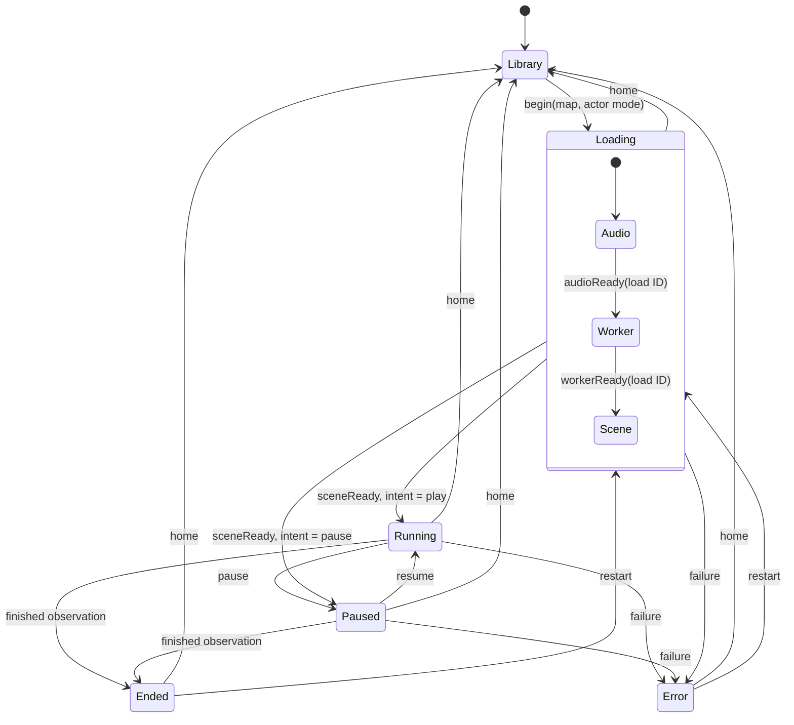

# Reference player ownership and playback lifecycle

The reference player composes browser adapters around the headless SDK. The application
transport is separate from the SDK's tick clock: loading a soundtrack or GPU resources is
an application concern, while collisions, scores, poses and replay remain SDK concerns.

## Ownership

| Module | Owns | Boundary with the entry point |
| --- | --- | --- |
| `playback.ts` | Explicit application states, load identity and legal transitions | Read-only selectors and transition methods; no DOM, worker or audio dependencies |
| `authoring.ts` | Imported map/song, saved generator recipe, analysis worker and authoring controls | Catalog reads, decode callback, selected-map callback and install notification |
| `accessibility.ts` | Spoken choices, narrator and audio-led setup controls | Requests playback/profile actions through a typed host; never writes transport flags |
| `desktop-controls.ts` | Pointer/keyboard gestures, stored hand aims and desktop/spectator camera | Reads playback selectors; returns ordinary hand samples |
| `xr-controls.ts` | XR session/controller events, grip poses, menu rays and haptic hardware | Reports hand samples and requests menu/playback actions |
| `xr-tracking.ts` | Tracking-loss grace period | Requires a tracked head and active tracked samples for both hands |
| `audio.ts`, `hand-audio.ts`, `haptics.ts` | Sound rendering and feedback planning | Consume shared observations, events and hand-guidance frames |
| `main.ts` | Composition, preferences, scene/HUD presentation and transport effects | Connects the adapters, worker messages and playback transitions |

Authoring and input adapters do not receive the whole mutable application state. Desktop input
receives a read-only selection of playback properties; other adapters request actions through
host callbacks. Factories are installed once per player document. The authoring worker is
disposed on page exit alongside the simulation worker, sound and rendering resources.

The entry point still owns rendering/HUD integration and settings composition. It is not an
empty bootstrap, but imports, accessibility and device input no longer share its local variables.
Future rendering or settings extractions should preserve these ownership boundaries rather than
introducing a shared global state object.

## Playback states

Loading has ordered audio, worker and scene stages plus a single play/pause intent. Pausing
during any stage changes that intent; resource completion does not undo the pause. Resume
cannot restart an ended or failed session. A failure offers restart/library recovery. Rendering
selectors such as `playing`, `running`, `canPause` and `acceptsInput` derive from this union;
they are not independently writable flags. `playing` means the scene is available, while
`canPause` also covers soundtrack preparation before that scene exists. Keyboard, menu and
visibility interruptions preserve the pause intent during preparation.

Each start and Home transition changes the load ID. The worker echoes it on ready, frame and
error messages; scene preparation captures it too. Old readiness, errors and GPU completions
are ignored after cancellation or replacement. Out-of-order or duplicate completions cannot
advance the state. Frame acknowledgments still drain the worker even when a stale frame is
discarded. Worker generation remains a separate backpressure identity, and the last observed
worker clock phase is used only to detect interruptions; neither controls the application state.
Replay downloads keep their own request IDs and use the returned recording's map identity, so
returning to the library while a requested export is pending cannot rename the recording.

## Review regressions

The explicit **Enable audio-led guidance** action restores the shared default guidance level
only when the saved level is zero, and updates the slider, label and persisted preference.
Existing nonzero choices remain intact.

The reported empty-controller `every()` failure did not occur through the original
`controllerSamples` adapter: it always returned left and right entries, with missing controllers
marked inactive and untracked. Tests now verify that behavior and a separate tracking guard
also rejects empty or incomplete sample arrays. Loss of either hand or the head reaches the
250 ms pause threshold; reacquisition or leaving active play resets the grace period.

Unit tests cover every loading-stage pause, cancellation, replacement, duplicate/out-of-order
callbacks, terminal states and controller/head loss. Browser tests inject delayed real-worker
readiness and an obsolete error after Home and a successor load, then complete the successor
through normal scoring. They also pause a held soundtrack download before releasing it and
verify an exported recording after returning to the library. Existing imports, generation
recipes, VR-independent input, replay,
audio and static-host production checks remain the regression boundary for adapter extraction.
